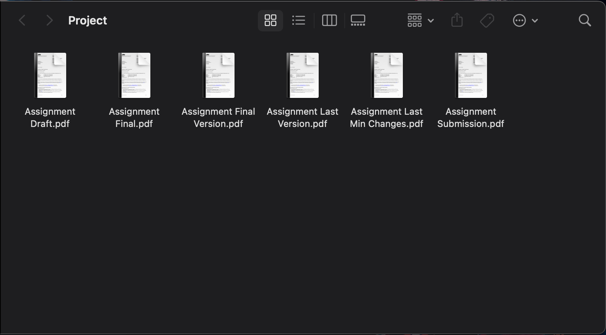
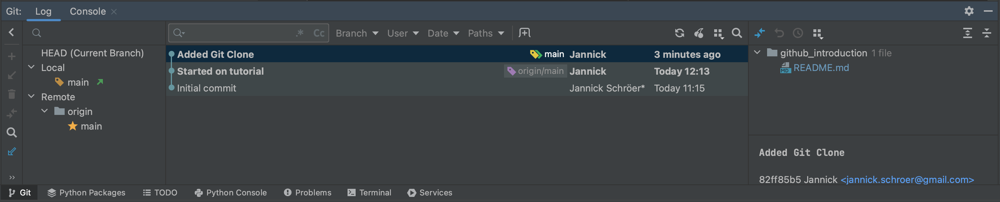
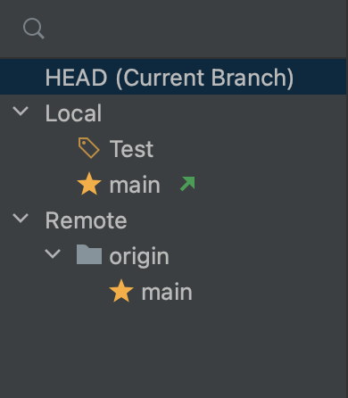
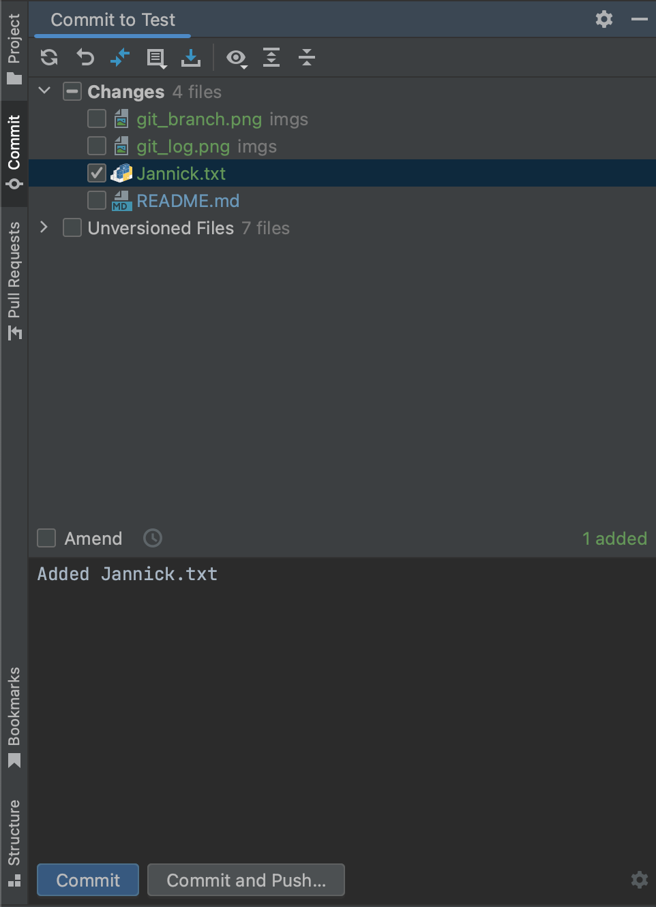
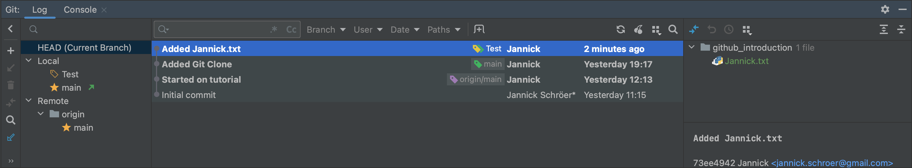
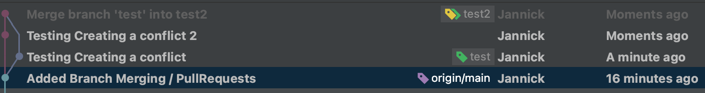

# Github Introduction
## Table of Contents
- [What is Version Control?](#what-is-version-control)
  - [1-Dimensional Version Control](#1-dimensional-version-control)
  - [2-Dimensional Version Control](#2-dimensional-version-control)
- [What is Git?](#what-is-git)
- [What is Github?](#what-is-github)
- [What is a Repository?](#what-is-a-repository)
- [Installing Git on your Computer](#installing-git-on-your-computer)
- [Creating SSH Keys](#creating-ssh-keys)
  - [Step 1: Check for existing SSH Keys](#step-1-check-for-existing-ssh-keys)
  - [Step 2: Create a new SSH Key](#step-2-create-a-new-ssh-key)
  - [Step 3: Add SSH Config](#step-3-add-ssh-config)
  - [Step 4: Add SSH Key to Github](#step-4-add-ssh-key-to-github)
  - [Step 5: Test SSH Connection](#step-5-test-ssh-connection)
- [Git Help](#git-help)
- [Cloning a Repository](#cloning-a-repository)
- [Creating a new Repository](#creating-a-new-repository)
- [Opening the Repository](#opening-the-repository)
- [Creating a branch](#creating-a-branch)
- [Making a change to the repository](#making-a-change-to-the-repository)
- [Committing the change](#committing-the-change)
- [Reversing a commit (Reverting)](#reversing-a-commit-reverting)
- [Merging a branch](#merging-a-branch)
  - [Pull Requests](#pull-requests)
  - [Merging](#merging)
- [Pushing / Pulling Changes](#pushing--pulling-changes)
- [Conflicts](#conflicts)
- [Gitignore](#gitignore)
- [Practicing](#practicing)
- [Resources](#resources)

## What is Version Control?
Version Control is something we use on a regular basis. 
It is how when ever we make a mistake we can go back to a previous version of the file.

### 1-Dimensional Version Control
This is the most basic form of version control.
It is also the type we are most familiar with.
Let's think of us writing an essay with a pencil and paper.
We write the first draft, while reading we find a paragraph that didn't make too much sense.
We erase the paragraph and rewrite it.
We have just used version control.

We have one simple problem with 1-Dimensional Version Control.
We can not go back to our first draft as we had erased it and written over it.

This is the exact same as when we are writing a word document or code.
You can always Ctrl+Z to go back in the timeline.
Once you edit a previous point in the timeline, the following points are erased.

### 2-Dimensional Version Control
This is the problem that 2-Dimensional Version Control solves.
A simple solution most people do is create a copy of the file.
This is a simple solution, but it is not a good solution.
You end up with folders full of files that are all similar, but slightly different and all named.



What if instead of making copies we instead create a branch in the timeline.
This allows us to go back to the previous point in the timeline, while also being able to go back to the current point in the timeline.
With the added benefit of being able to merge the two timelines together at a later point.

## What is Git?
Git is a version control system.
It does pretty much the exact same thing we just talked about.
- We have a timeline of our project.
- We can create branches in the timeline.
- We can merge branches together.
- We can go back to previous points in the timeline.

## What is Github?
Github is a website that hosts git repositories.
It is a place where we can upload our timeline and branches.
This allows us to share and collaborate on projects.

Github is not the only website that hosts git repositories. (Gitlab, Bitbucket, etc.)

## What is a Repository?
A repository is a folder that contains all the files for a project.
It also contains the timeline and branches for the project.

On Github you can see your repositories by clicking on your profile picture in the top right corner and clicking on "Your repositories".

## Installing Git on your Computer
You should be able to run the command:
```bash
git --version
```
If you get an error, you need to install git.
You can download git from [here](https://git-scm.com/downloads).
They also offer a [tutorial](https://git-scm.com/book/en/v2/Getting-Started-Installing-Git) on how to install git on your computer.

## Creating SSH Keys
SSH Keys are used to identify your computer to Github. 
You can think of it as a digital signature.
Github has a [tutorial](https://docs.github.com/en/github/authenticating-to-github/connecting-to-github-with-ssh) on how to create SSH Keys.
As the tutorial goes over more than just creating SSH Keys, I will go over the steps here.

### Step 1: Check for existing SSH Keys
```bash
ls -la ~/.ssh
```
If you see a file ending in `.pub`, you already have SSH Keys and can skip to Step 4.
You can of course create a separate SSH Key for Github, but it is not necessary.

### Step 2: Create a new SSH Key
```bash
ssh-keygen -t ed25519 -f "~/.ssh/Github"
```
Enter a passphrase when prompted. (You can leave it blank if you want.)

Your `.ssh` folder should now contain two files:
- `Github`
- `Github.pub`

### Step 3: Add SSH Config
You will need to add a file called `config` to your `.ssh` folder.
I will be using the nano text editor, but you can use any text editor you want.
```bash
nano ~/.ssh/config
```

Add the following to the file:
```
Host github.com
  PreferredAuthentications publickey
  IdentityFile ~/.ssh/Github
```

If you have other keys and no `config` file yet, you can add the other keys configurations too.
If you already have a `config` file, you can add the above to the file.

### Step 4: Add SSH Key to Github
You will need to add your SSH Key to Github.

You can upload your ssh key [here](https://github.com/settings/keys).

### Step 5: Test SSH Connection
```bash
ssh -T git@github.com
```
If you get a warning about the authenticity of the host, type `yes` to continue.

If you get a message saying "Hi <username>! 
You've successfully authenticated, but GitHub does not provide shell access.", you have successfully set up your SSH Key.

## Git Help
You can learn more about the git commands by running the command:
```bash
git -h
```

You can also learn more about a specific command by running the command:
```bash
git <command> -h
```

## Cloning a Repository
Cloning a repository is how we download a repository from Github to our computer.
This is the first step in working on a project from other people.
We first need to get the clone link from Github.
You can find the clone link by clicking on the green "Code" button on the repository page.
Select the SSH option and copy the link.

Now we can clone the repository.
```bash
git clone <link>
```
As an exercise we will clone this repository.
```bash
git clone git@github.com:Nautilus-UUV/github_introduction.git
```
If you typed a passphrase when creating your SSH Key, you will be prompted to enter it.

You will now have a folder called `github_introduction` in your current directory.

## Creating a new Repository
Sometimes you don't want to clone a repository.
You want to create a new repository.
On Github click on the `New` button on the repositories page.
You can then give the repository a name and select if you want it to be public or private.
Most of our repositories will be private as they contain code we don't want to share with the world.
You can also add a description to the repository.

You can also create a folder on your computer and run the command:
```bash
git init
```
This will start tracking the folder with git.
You can then add the remote (server) repository with the command:
```bash
git remote add origin <link>
```
For pushing / pulling changes you can look at [this section](#pushing--pulling-changes)

## Opening the Repository
You can open the repository in your favourite IDE.
I will be using Jetbrains Pycharm, so Pictures will be from Pycharm.
Jetbrains IDEs can be downloaded for free with a student email [here](https://www.jetbrains.com/community/education/#students).

We can now use our first git command.
```bash
git log
```
This will show us the timeline of the repository.
You can use the arrow keys to scroll up and down, and press `q` to exit.

With Jetbrains IDEs you can also see the timeline in the bottom left corner under the `git`tab.


Each point in this timline is called a commit.
A commit is a point in the timeline where we have made a change to the repository.

## Creating a branch
We can now create a branch.
```bash
git branch <branch_name>
```
We can now switch to the branch.
```bash
git checkout <branch_name>
```

Alternatively we can create and checkout a branch with one command.
```bash
git checkout -b <branch_name>
```

For this exercise create a branch with your name.

In Jetbrains IDEs you can create a branch by clicking on the `git` tab in the bottom left corner.
You click the commit you want to branch from and click `New Branch`.
In Jetbrains the new branch will automatically be checked out (you can se the checked out branch with the price tag icon).
You can checkout a branch by clicking on the branch name and selecting the branch you want to check out.


You can now see the branch in the bottom left corner.


## Making a change to the repository
We can make changes to any of the branches.
It is important to note often you will have something called "main" or "master" protection.
This means you can not make changes to the main branch.
You will need to create a branch and make changes to that branch.
This is to prevent people from making changes to the main branch without review,
as the main branch is often the branch that is deployed / used.

As an exercise we will be making a new file.
Create a new file called `<your_name>.txt` in the `github_introduction` repository.
Per default git will not track this file.

We can see this by running the command:
```bash
git status
```
The file should be in the untracked files section.

To add it to the tracked files we can run the command:
```bash
git add <file_name>
```
We can now see the file in the staged files section.

You can also stage all untracked files with the command:
```bash
git add .
```

On Jetbrains IDEs after creating the file you will get a popup asking if you want to add the file to git.
Or you can always later right click on the file and select `Git -> Add`.

## Committing the change
For any major change we made to the repository we want to create a commit.
This includes stuff like:
- Adding a new file
- Deleting a file
- Changing a file
- Fixing a bug
- Adding a feature
- etc.
You should always create a commit for each of these changes alone. 
Do not cluster them together.
This makes it easier to find the commit that introduced a bug.

To commit the change we can run the command:
```bash
git commit -m "<commit_message>"
```
The commit message should be a short description of what the commit does.
For example:
- "Added <file_name>"
- "Fixed bug in <file_name>"
- "Fixed problem <issue_id> in <file_name>"
- "Added feature <feature_name>"
- etc.

On Jetbrains IDEs you can commit by clicking on the `commit` tab in the left side bar.
Here you can see the files that have been changed.
You can select the files you want to commit.



Once you have commited you can check the `git log` and you should be able to see your commit.



## Reversing a commit (Reverting)
Sometimes we make a mistake and want to undo a commit.
We can either: revert the commit, or, create a new branch starting from a point before the mistake was made.

As you already know how to create a branch, we will go over how to revert a commit.

To revert a commit we first need to find the commit we want to revert.
We can look at the log and find the commit we want to revert.
We can then copy the commit hash. This is the 8 character long string in the commit message.

We can now revert the commit.
```bash
git revert <commit_hash>
```
This will create a new commit that reverts the changes made in the commit we specified.
In Jetbrains IDEs you can revert a commit by right-clicking on the commit and selecting `Revert Commit`.

As an exercise, revert the commit you just made.

## Merging a branch
### Pull Requests
Once we are done with the changes we made in a branch, we want to merge it back into the main branch.
This is done by creating a pull request.
A pull request is a request to merge a branch into another branch.
This is done so that someone else can review the changes before they are merged.

A pull request is created on Github.
You can go to the `Pull requests` tab on the repository page and click `New pull request`.
You can then select the branch you want to merge into the main branch.
You can then add a title and description to the pull request.
You can also add reviewers to the pull request.
Once you are done you can click `Create pull request`.

### Merging
Sometimes we want to merge a branch without a pull request.
This is often the case when we are merging a branch into our own branch.
For example when we are merging the new bug fix on the main branch into our feature branch.

To merge a branch we first need to checkout the branch we want to merge into.
Then we can run the command:
```bash
git merge <branch_name>
```
This will merge the branch into the branch we are currently on.

As an exercise merge your branch into the main branch.
So checkout the main branch and merge your branch into the main branch.

Once we have merged the branch we can delete the branch (if we don't need it anymore).
As an exercise delete your branch.
```bash
git branch -d <branch_name>
```

### Rebasing
Rebasing is a tool to change the history of a given branch.
As an example: If you work for a longer time in a seperate branch, there is the possibility that the master/main branch get updated in the mean time. To keep the branch updated one can use `git rebase <branch_name>` to update the commits of the current branch with the commits made on another branch (use `git rebase origin/<branch_name>` to update your branch with respect to the remote branch.

#### ATTENTION:
As changing the history of a branch somewhat conflicts with the general idea of git versioning. Differing remote and local branches can require `git push --force` in order to push the new history to the remote repo. Only force push if you are completly sure about your changes!

## Pushing / Pulling Changes
We are now done with the changes we made to the repository.
We want to upload the changes to Github so that other people can see them.
This is done by pushing the changes to Github.
We can push the changes by running the command:
```bash
git push
```
This will push the changes to the branch we are currently on.
This will make the branch on Github the same as the branch on our computer.

If we want to get changes our colleagues have made we can pull the changes.
This is done by running the command:
```bash
git pull
```

On Jetbrains IDEs you can push and pull by clicking the Arrows in the top right corner.

## Conflicts
Sometimes when we pull, push or merge we get a conflict.
This is no reason to panic. 
This is a normal part of working with git.
A conflict happens when git can not automatically merge the changes.
For example when two people have changed the same function in a file.

This means we have to manually select which changes we want to keep.
We can do this by opening the file in our favourite text editor.
We will see something like this:
```
<<<<<<< HEAD
This is the change I made
=======
This is the change my colleague made
>>>>>>> <branch_name>
```
We can now select which change we want to keep.
Once we are happy with the changes we can save the file.
We can then add the file again to git with `git add` and commit the changes.

Jetbrains IDEs have a built in tool to help with conflicts.

If you want to see a conflict, create a two new branches.
In both branches create a new file called `conflict.txt` with different content.
Merge one branch into the other branch.
You should now have a conflict.

Once you have resolved the conflict, push the changes to Github.
The timeline should now look something like this:


If you want to see some conflicts while pushing. Have a colleague push some changes to the same file you are pushing to.

## Gitignore
Sometimes we have files we don't want to track with git.
For example:
- Files that are created when we run our code (Like log files).
- Files that contain sensitive information.
- Files that are created by our IDE.
- etc.

We can tell git to ignore these files by creating a `.gitignore` file.
The exact syntax of this file can be found [here](https://git-scm.com/docs/gitignore).

## Practicing
If you want to practice even more there are some resources I can recommend:
- [Git Branching](https://learngitbranching.js.org/)
- [Oh My Git](https://blinry.itch.io/oh-my-git)
- [Git Exercises](https://gitexercises.fracz.com/)

## Resources
- [Git Documentation](https://git-scm.com/doc)
- [Github Documentation](https://docs.github.com/en)
- [Git Cheat Sheet](https://education.github.com/git-cheat-sheet-education.pdf)
